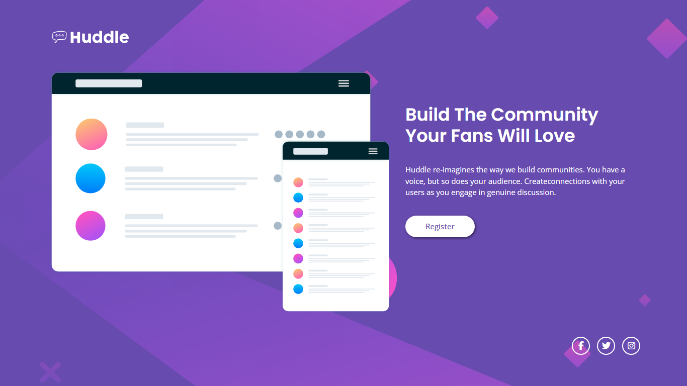
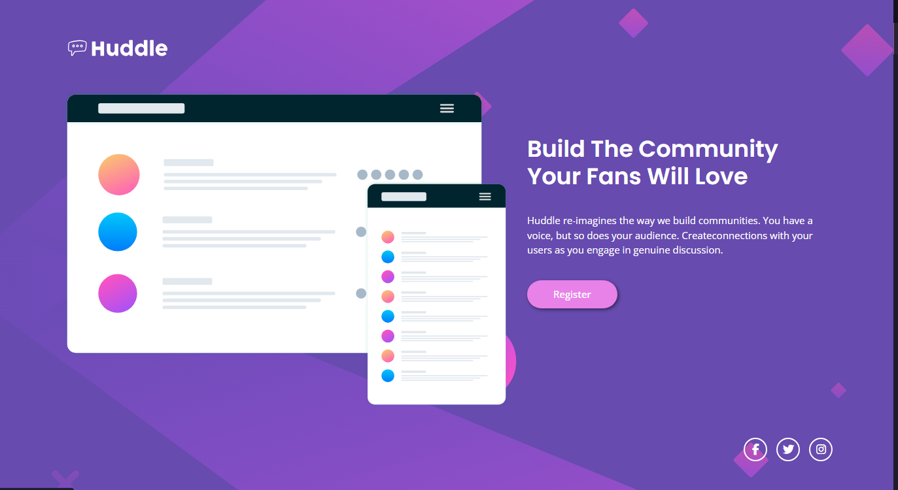
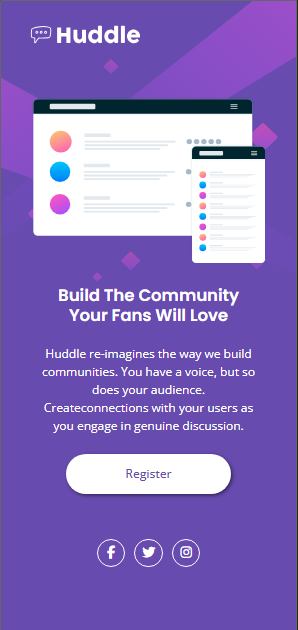
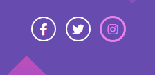

# 🚀 landing-page-huddle

> Um painel simples, bonito e dinâmico; este exercício demonstra minha fase no processo para me tornar um Desenvolvedor Web.

## 📌 Índice
- [Sobre o Projeto](#sobre-o-projeto)
- [Demonstração](#demonstração)
- [Tecnologias Utilizadas](#tecnologias-utilizadas)
- [Contato](#contato)

---

## 📝 Sobre o Projeto

Este projeto é uma landing page simples, mas que traz a essência da empresa e seus valores. Ele marca um território significativo na memória de seus usuários, construindo um **branding** de valor para a companhia.

---

## 🎯 Demonstração

  
  

    <h3>Design Desktop</h3>
    
    <h3>Active States</h3> 
    
  
  
 

  

  <h3>Design Mobile</h3>
      
    <h4>Active States-icons</h4>
  
  

---

## ⚙️ Tecnologias Utilizadas
Este projeto foi desenvolvido com as seguintes tecnologias:

📑 • **HTML5**  
🎨 • **CSS3**   

---

## 📞 Contato
Se quiser entrar em contato comigo:

📧 Email: <a href="mailto:Tobiasjonathan098@gmail.com" target="_blank">Tobiasjonathan098@gmail.com</a>

🔗 LinkedIn: <a href="https://www.linkedin.com/in/tobias-jonathan-" target="_blank">www.linkedin.com/in/tobias-jonathan-</a>

📌 GitHub: <a href="https://github.com/tobias-jonathan" target="_blank">github.com/tobias-jonathan</a>
